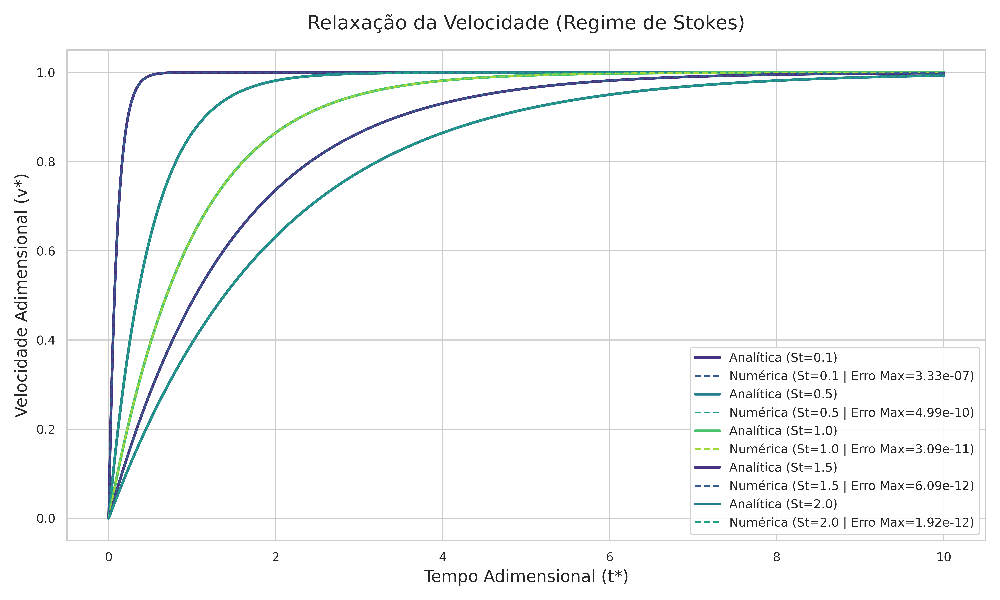
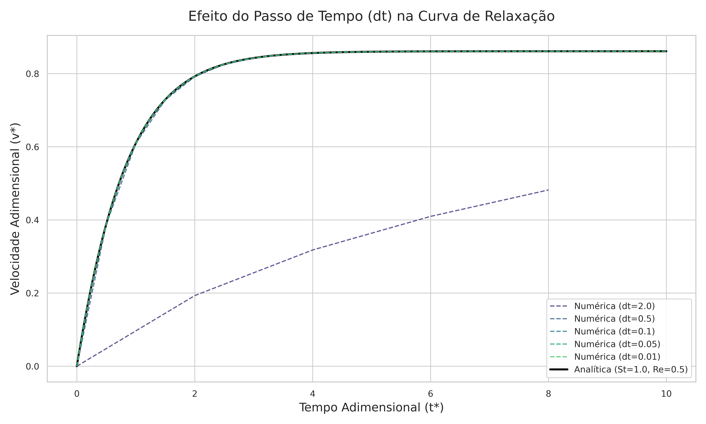
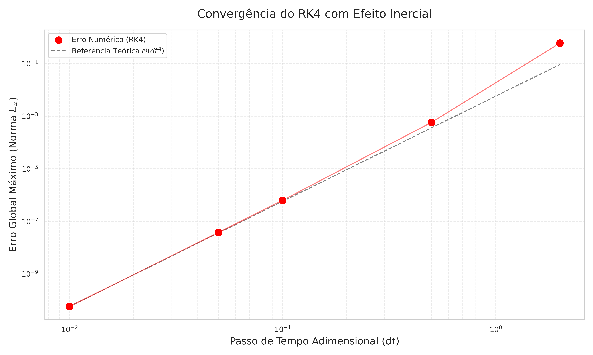
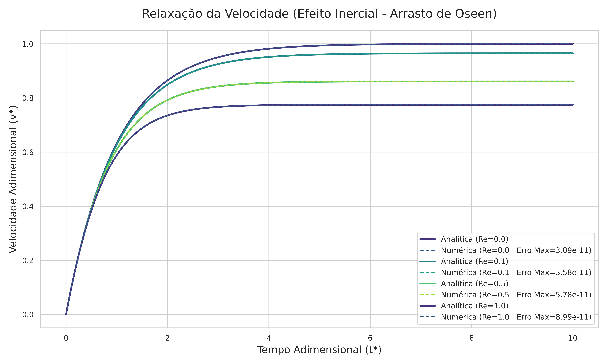

# Solver numérico RK4

## Resumo

Este projeto busca implementar um solver RK4 para o estudo da sedimentação de uma partícula em regime de stokes. O projeto foi estruturado da seguinte maneira.

``` plain text
└── 📁4th Order Runge-Kutta
    └── 📁figures
        ├── analise_convergencia_dt.png
        ├── comparacao_curvas_dt.png
        ├── comparacao_Re.png
        ├── comparação_St.png
    ├── .gitignore
    ├── analysis.py
    ├── main
    ├── main.cpp
    ├── PPC1 e APC1.pdf
    ├── README.md
    └── solver_rk4.hpp
```

O motor do solver é o arquivo [solver_rk4.hpp](solver_rk4.hpp), este é um arquivo de cabeçalho cujo objetivo é permitir que seja inserido num arquivo orquestrador. Para as análises aqui apresentadas, o arquivo orquestrador utilizado foi o [main.cpp](main.cpp). Por fim, para realizar as plotagens e comparações com valores analíticos, utilizou-se um script em python [analysis.py](analysis.py). Para informações sobre dependências e compilação favor referir a seção [#7](#7-instruções-de-uso).

## 1 Introdução

A análise da dinâmica de partículas esféricas imersas em escoamentos fluidos é um problema clássico e de extrema relevância conceitual na mecânica dos fluidos e em diversas aplicações de engenharia. Um fenômeno de particular interesse é a curva de relaxação da velocidade da partícula, que descreve o seu comportamento transiente desde o repouso até o alcance da velocidade terminal, sendo este movimento governado pelo balanço entre as forças inerciais e as forças de arrasto.

No limite de escoamentos rastejantes, caracterizado por um Número de Reynolds tendendo a zero ($Re \rightarrow 0$), o arraste imposto pelo fluido é puramente viscoso e perfeitamente descrito pela Lei de Stokes. Neste cenário, a Equação Diferencial Ordinária (EDO) que rege a cinemática da partícula é linear, admitindo uma solução analítica exata na forma de decaimento exponencial, cujo tempo característico é ditado pelo Número de Stokes ($St$):

$$ v_{z}^{\ast}(t) = 1 - e^{-t/St} $$

Contudo, a introdução de efeitos inerciais no escoamento ($Re \neq 0$) gera um desvio desse comportamento ideal. A força de arrasto adquire componentes não-lineares, frequentemente modeladas pela aproximação de Oseen, o que eleva a complexidade da EDO para uma forma análoga à Equação de Riccati, que ainda pode ser resolvida analiticamente:

$$ v_{z}^{\ast}(t) = v^{\ast} + \left[ \frac{Q}{P} + \left(-\frac{1}{v^{\ast}} - \frac{Q}{P} \right) e^{-Pt^{\ast}} \right]^{-1} $$

Para solucionar modelos matemáticos não-lineares com eficiência, a aplicação de métodos de integração numérica torna-se indispensável. O presente relatório documenta o desenvolvimento, a verificação e a análise de um solver numérico computacional, implementado em linguagem C++, voltado para a resolução do problema de valor inicial da relaxação da partícula através do método de Runge-Kutta de quarta ordem (RK4).

O objetivo principal deste trabalho é validar a robustez da implementação numérica frente a diferentes cenários físicos. Para tanto, as soluções numéricas geradas são confrontadas com as respectivas soluções analíticas exatas, tanto no regime estrito de Stokes quanto sob influência inercial. Adicionalmente, o relatório apresenta um estudo de convergência do método a partir do refinamento do passo temporal, além de discutir as implicações físicas do arraste não-linear no tempo de relaxação do sistema.

## 2 Implementação do solver

Como já mencionado na introdução, o solver foi implementado em linguagem C++ com o objetivo de reduzir o tempo necessário para computar todos os resultados. O Runge-Kutta de quarta ordem é um algoritmo relativamente simples que busca melhorar a acurácia numérica a partir da estimativa de "sub-passos" de tempo:

$$y_{i+1} = y_{i} + \frac{\Delta t}{6}(k_{1} + 2k_{2} + 2k_{3} + k_{4})$$

onde,

$$f(t_{i},y_{i}) = \frac{dy}{dt}$$

$$k_{1} = f(t_{i},y_{i})$$

$$k_{2} = f\left(t_{i} + \frac{\Delta t}{2},\ y_{i} + \frac{\Delta t}{2}k_{1}\right)$$

$$k_{3} = f\left(t_{i} + \frac{\Delta t}{2},\ y_{i} + \frac{\Delta t}{2}k_{2}\right)$$

$$k_{4} = f(t_{i} + \Delta t,\ y_{i} + k_{3}\Delta t)$$

Por meio da primeira APC já possuímos a primeira derivada da equação que buscamos aproximar, o que torna a implementação do método ainda mais simples. Bastando implementar um loop de cálculo que realize todas essas operações e incremente os valores:

$$\frac{dv_{z}^{\ast}}{dt} = \frac{\left(1 - v_{z}^{\ast} - \frac{3}{8}Re \cdot v_{z}^{*2}\right)}{St}$$

Para facilitar a organização e o uso futuro, foi criado um arquivo mestre (orquestrador) e um arquivo em que foi implementado, de fato, o algoritmo. Por fim, para a plotagem dos gráficos utilizados neste relatório, foi criado um script em Python, pois a facilidade do uso das bibliotecas de plotagem compensa o maior custo computacional. Todos estão disponíveis neste repositório GitHub.

## 3 Caso assintótico: $Re \rightarrow 0$

Este é o caso que possui solução analítica mais simples e que foi trabalhada durante a aula. É um ponto excelente de partida para verificar a robustez do método numérico. Utilizando de forma fixa um passo temporal de **0.01**, um tempo (adimensional) total de **10** e uma velocidade inicial de **0**, variou-se o valor de $St$ entre **0.1** e **2**. Os resultados estão apresentados na Figura 1.

>
*Figura 1: Comparativo entre a solução numérica e analítica para o relaxamento da velocidade durante a sedimentação de uma esfera em regime de Stokes, para diferentes Números de Stokes*

Apesar de os erros globais máximos - calculados por meio da equação abaixo - serem todos muito pequenos, há uma clara correlação entre um menor valor de $St$ e um maior erro. A origem desta tendência é, muito provavelmente, a diferença entre a suavidade das curvas com menor número de Stokes e aquelas com maior número de Stokes. As curvas com um $St$ menor ascendem muito rapidamente e possuem pouca suavidade na entrada para o platô, características essas que não são favoráveis para uma boa aproximação numérica.

$$E_{max} = \max\!\left(|v_{num}^{\ast}(t) - v_{ana}^{\ast}(t)|\right)$$

Contudo, é interessante destacar que as velocidades terminais são sempre as mesmas, a velocidade de Stokes ($U_{s}$). Apesar desta ressalva, todas as curvas chegaram a uma aproximação excelente - com erros baixíssimos - e foram consideradas muito satisfatórias.

## 4 Influência do passo temporal

Neste caso, analisou-se a influência do tamanho do passo temporal dado a cada operação do laço. O valor de $\Delta t$ foi variado de **0.01** a **2**, mantendo-se, assim como no caso anterior, um tempo total de simulação de **10** e uma velocidade inicial nula. Os números de Reynolds e Stokes foram mantidos fixos em **0.5** e **1**, respectivamente.

>

*Figura 2: Análise da influência do tamanho do passo temporal na qualidade da aproximação numérica. (a) Análise visual das curvas numéricas em comparação com a analítica e (b) Análise de convergência por meio do erro global máximo*

Ao analisarmos somente a Figura 2a, é difícil distinguir as curvas a partir de $\Delta t = 0.1$. Com exceção da curva para $\Delta t = 2$ - que está completamente longe da analítica - e da curva para $\Delta t = 0.5$, onde é possível ver alguns pontos de separação, todas as demais estão extremamente próximas da curva analítica.

Contudo, ao analisarmos a Figura 2b, a natureza do erro fica muito mais clara e a tendência esperada - de que esse erro fosse da ordem de $\Delta t^{4}$ - é quase perfeitamente seguida. Ou seja, ao aumentarmos o $\Delta t$ em apenas 2 vezes, estamos aumentando o erro em aproximadamente 16 vezes.

Para simulações simples como a analisada, o valor de $\Delta t$ que fornece valores ótimos não incorre em grande custo computacional. Porém, em problemas mais complexos, a discretização temporal necessária pode inviabilizar uma simulação.

## 5 Influência dos efeitos de inércia ($Re \neq 0$)

Nesta última análise verificou-se tanto o comportamento da solução numérica para equações um pouco mais complexas quanto a influência dos efeitos de inércia no escoamento estudado. Foi adotado um valor de $\Delta t = 0.01$, um tempo total de simulação de **10**, uma velocidade inicial nula e um Número de Stokes igual a **1**. Os valores para o Número de Reynolds variaram de **0 a 1**.

> 
> *Figura 3: Comparativo entre a solução numérica e analítica para o relaxamento da velocidade durante a sedimentação de uma esfera em regime de Stokes, para diferentes Números de Reynolds*

A solução numérica convergiu muito bem para a solução analítica e houve pouca diferença nos erros entre as diferentes curvas. A partir da análise da Figura 3, é possível perceber que o número de Reynolds impacta pouco na taxa de aumento da velocidade e na suavidade da curva, contudo tem grande impacto na velocidade terminal da esfera - efeito que pode ser considerado "complementar" ao apresentado pelo número de Stokes.

Este efeito de diminuição da velocidade terminal é esperado, uma vez que o número de Reynolds está diretamente relacionado com o aumento da influência dos efeitos inerciais e o surgimento de novas forças de arrasto inerciais que são não-lineares.

## 6 Conclusão

O presente trabalho cumpriu com o objetivo de implementar e validar um solver numérico baseado no método de Runge-Kutta de quarta ordem (RK4) para o problema da sedimentação de uma partícula esférica. A excelente concordância entre as curvas numéricas e as soluções analíticas exatas, evidenciada pelos baixíssimos erros globais máximos (na ordem de $10^{-7}$ a $10^{-11}$), atesta a robustez e a correta implementação do algoritmo em linguagem C++.

Além da validação visual, o estudo de convergência validou a ordem teórica do método numérico. A análise logarítmica demonstrou que o erro decai proporcionalmente a $\Delta t^{4}$, comprovando a eficiência do RK4 adotado.

Do ponto de vista físico, a análise paramétrica permitiu observar com clareza os papéis distintos dos números adimensionais. Enquanto o Número de Stokes ($St$) governa o tempo de relaxação do sistema no limite de arrasto puramente viscoso, a introdução do Número de Reynolds ($Re$) incorpora os efeitos inerciais e o arrasto não-linear de Oseen. Esta alteração na dinâmica fluida resulta em uma redução substancial da velocidade terminal alcançada pela partícula, conforme esperado teoricamente.

Conclui-se que o desenvolvimento metodológico percorrido - partindo de um caso limite assintótico conhecido e adicionando complexidade progressivamente - não apenas garantiu a confiabilidade do código, mas também fortalece a confiabilidade dos métodos numéricos para casos ainda mais complexos.

## **7** Instruções de Uso

Para garantir a reprodutibilidade dos resultados apresentados neste relatório, os códigos foram estruturados de forma modular e automatizada. Abaixo estão as etapas necessárias para compilar o solver em C++ e gerar os gráficos da análise utilizando Python.

### Pré-requisitos

Certifique-se de ter os seguintes ambientes configurados em sua máquina:

* **Compilador C++**: GCC (`g++`), Clang ou MSVC, com suporte a C++17 ou superior (devido ao uso da biblioteca `<filesystem>`).
* **Python 3.x**: Caso queira usar o script incluso de plotagem. É necessário instalar as bibliotecas de plotagem e análise de dados, elas podem ser obtidas executando o comando:
  `pip install pandas numpy matplotlib seaborn`

### Entendendo os Parâmetros de Entrada

O orquestrador numérico (`main.cpp`) invoca a função `solver_rk4` passando parâmetros físicos e numéricos. Caso deseje configurar novos cenários, você pode alterar os seguintes valores diretamente no código:

* **`St` (Número de Stokes):** Parâmetro físico que dita o tempo de relaxação característico da partícula. Valores maiores indicam partículas com maior inércia.
* **`Re` (Número de Reynolds):** Parâmetro físico que controla a influência do arrasto não-linear. Defina como `0.0` para simular o regime estrito de Stokes ou valores $>0$ para incluir efeitos inerciais (arrasto de Oseen). Para valores muito altos de Re - ordem maior que 1 - as equações utilizadas neste trabalho não são válidas.
* **`inicialVelocity`:** Velocidade adimensional da partícula no instante $t=0$. Neste estudo, foi mantida em `0.0` (partícula partindo do repouso).
* **`stopTime`:** Tempo adimensional total da simulação (o momento em que o laço de cálculo é encerrado).
* **`deltaT` ($\Delta t$):** O passo de tempo da integração numérica. Valores menores aumentam a precisão do RK4 (diminuem o erro), mas elevam o custo computacional.

### Passo 1: Compilação e Execução do Solver (C++)

O orquestrador numérico (`main.cpp`) e o cabeçalho contendo a implementação do método (`solver_rk4.hpp`) devem estar no mesmo diretório raiz do projeto.

Abra o terminal nesta pasta e compile o código. Se estiver usando o `g++`, o comando será:

```bash
g++ main.cpp -o solver
```

Este comando deve gerar um binário com nome *solver*, ao executá-lo o programa criará uma subdiretório *results* e nele os resultados da simulação serão salvos em arquivos *csv* de acordo com o que foi configurado no orquestrador.

Para utilizar o arquivo de plotagem incluso basta que este esteja salvo no mesmo diretório em que o diretório *results* está salvo. Para utilizá-lo o comando será:

```bash
python main.py
```

As imagens serão salvas num subdiretório *figures*.
