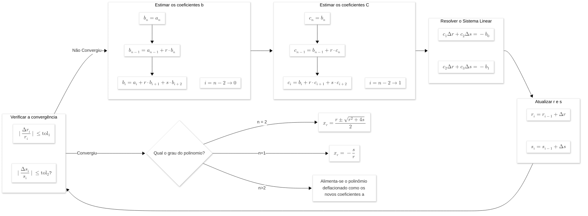

# Solver numérico Bairstow

## Resumo

Este projeto busca implementar um solver numérico para buscar raízes de polinômios utilizando o método de Bairstow. O projeto foi estruturado da seguinte maneira:

``` plain text
└── 📁Bairstow
    └── 📁figures
        ├── fractal_pol_7.png
        ├── fractal_pol_carac.png
        ├── fractal_pol_pdf.png
    ├── .gitignore
    ├── main.cpp
    ├── plot_fractal.py
    ├── README.md
    └── solver.hpp
```

O motor do solver é o arquivo [bairstow_solver.hpp](bairstow_solver.hpp), este é um arquivo de cabeçalho cujo objetivo é permitir que seja inserido num orquestrador. Para as análises propostas na matéria foi desenvolvido o orquestrador [main.cpp](main.cpp). Por fim, para realizar a plotagem dos fractais de Bairstow a partir dos arquivos de saída -- do tipo .csv -- elaborou-se um pequeno script em python [plot_fractal.py](plot_fractal.py).

Caso deseje somente as instruções de compilação e uso, favor se dirigir à [Instruções de uso](#instruções-de-uso)

## Introdução

Polinômios são estruturas fundamentais amplamente presentes em problemas físicos e matemáticos. Uma formulação analítica geral para a solução de polinômios de um grau qualquer ***n*** é um problema antigo que tem sido atacado por inúmeros matemáticos ao longo de séculos. As formulações para polinômios de grau 1 e 2 são simples e conhecidas há milênios, soluções analíticas para polinômios de 3° e 4° grau só se tornaram conhecidas no século XVI e estão muitos graus de complexidade acima das anteriores. Soluções analíticas gerais para polinômios de ordem $\gt 5$ são desconhecidas.

Em face deste desafio, métodos numéricos capazes de encontrar raízes para polinômios com uma ordem qualquer são importantíssimos. O método de Bairstow é um dos mais famosos, permitindo achar raízes de polinômios de qualquer ordem de forma eficiente e precisa, tendo aparecido pela primeira vez no livro *Applied Aerodynamics* do engenheiro aeronáutico *Sir Leonard Bairstow*.

## Implementação do solver

O método de bairstow é um método iterativo cuja ideia principal é dividir um polinômio $f_n(x)$ por um fator quadrático $D(x) = x^2 - rx - s$, em que $r$ e $s$ são coeficientes reais a serem ajustados pelo método de Newton-Raphson até que o resto ($R(x)$) da divisão seja nulo. Quando isto ocorre, o método é aplicado novamente no polinômio resultante ($f_{n-2}(x)$) até que este tenha grau $\le 2$. Por fim, aplica-se uma das formulações conhecidas para o grau do polinômio para encontrar as últimas raízes. Abaixo há um fluxograma do método.



## Validação do solver

Antes de partir para a análise do sistema dinâmico, o solver foi validado utilizando-se um polinômio com raízes conhecidas -- obtidas por meio da multiplicação de monômios. O polinômio escolhido foi:

$$
\begin{aligned}
    P(x) &= (x-1)(x+2)(x-3)(x+4)(x-5)(x+6)(x-7) \\
    P(x) &= x^7 - 4x^6 - 62 x^5 + 200 x^4 + 1009 x^3 - 2356 x^2 - 3828 x + 5040
\end{aligned}
$$

A saída obtida ao rodar o orquestrador para este polinômio é:

```plain text
========================================
       1. Validação do solver           
========================================

Palpites iniciais: r = 2.5, s = 2.5
Tolerancia: 1e-06

Raiz 1: 5.000000 + 0.000000i
Raiz 2: -6.000000 + 0.000000i
Raiz 3: 2.999999 + 0.000000i
Raiz 4: -3.999999 + 0.000000i
Raiz 5: 0.999999 + 0.000000i
Raiz 6: -1.999999 + 0.000000i
Raiz 7: 7.000000 + 0.000000i
----------------------------------------
Total de iterações: 39
Processo convergiu: Sim
```

Fica evidente a precisão do método bem como sua eficiência, pois foram necessárias apenas 39 iterações para encontrar todas as 7 raízes. Para avaliar ainda melhor a eficiência do método, foi avaliado o número de iterações necessárias para calcular as raízes deste mesmo polinômio para diferentes pares de entrada $(r_0,s_0)$, são estes pares: $(0.1,0.1), \ (0.25,0.25), \ (0.5,0.5), \ (1,1), \ (2,2), \ (5,5) \ \text{e} \ (10,10)$. A saída obtida a para esta análise foi:

```plain text
========================================
     2. Análise de Convergência         
========================================

Par (r, s) do chute (0.100000, 0.100000)
Total de iterações: 13
Processo convergiu: Sim
Par (r, s) do chute (0.250000, 0.250000)
Total de iterações: 14
Processo convergiu: Sim
Par (r, s) do chute (0.500000, 0.500000)
Total de iterações: 44
Processo convergiu: Sim
Par (r, s) do chute (1.000000, 1.000000)
Total de iterações: 12
Processo convergiu: Sim
Par (r, s) do chute (2.000000, 2.000000)
Total de iterações: 26
Processo convergiu: Sim
Par (r, s) do chute (5.000000, 5.000000)
Total de iterações: 15
Processo convergiu: Sim
Par (r, s) do chute (10.000000, 10.000000)
Total de iterações: 23
Processo convergiu: Sim
```

Esta análise reforça ainda mais a eficiência do método, havendo casos em que a convergência ocorreu em apenas 12 iterações.

## Caso estudado

A análise de vibrações em sistemas estruturais ou mecânicos com múltiplos graus de liberdade (gdl) baseia-se na segunda lei de Newton. Quando introduzimos amortecimento no sistema, a formulação matemática nos leva a um problema de autovalor que gera um polinômio característico de grau $2n$, onde $n$ é o número de graus de liberdade.

### 1. A Equação de Movimento

Para um sistema discreto massa-mola-amortecedor com $n$ graus de liberdade em vibração livre (sem forças externas de excitação), a equação diferencial governante é escrita em forma matricial como:

$$
[M]\{\ddot{x}(t)\} + [C]\{\dot{x}(t)\} + [K]\{x(t)\} = \{0\}
$$

Onde:

* $[M]$ é a matriz de massa ($n \times n$)
* $[C]$ é a matriz de amortecimento ($n \times n$)
* $[K]$ é a matriz de rigidez ($n \times n$)
* $\{x(t)\}$ é o vetor de deslocamentos ($n \times 1$)
* $\{\dot{x}(t)\}$ e $\{\ddot{x}(t)\}$ são os vetores de velocidade e aceleração, respectivamente.

### 2. Proposição da Solução

Como se trata de um sistema de equações diferenciais lineares homogêneas, assumimos uma solução do tipo exponencial, que descreve tanto a oscilação quanto o decaimento (ou crescimento) da resposta:

$$\{x(t)\} = \{\phi\} e^{\lambda t}$$

Onde $\{\phi\}$ é um vetor constante de amplitudes (autovetor) e $\lambda$ é uma constante escalar (autovalor). Derivando essa solução no tempo, temos:

* $\{\dot{x}(t)\} = \lambda \{\phi\} e^{\lambda t}$
* $\{\ddot{x}(t)\} = \lambda^2 \{\phi\} e^{\lambda t}$

### 3. O Problema de Autovalor Quadrático

Substituindo essas derivadas de volta na equação de movimento original e dividindo tudo pelo termo escalar não-nulo $e^{\lambda t}$, chegamos a:

$$(\lambda^2[M] + \lambda[C] + [K])\{\phi\} = \{0\}$$

Esta equação é conhecida como um **Problema de Autovalor Quadrático (QEP)**. Para que exista uma solução não-trivial (ou seja, para que o sistema efetivamente vibre e $\{\phi\} \neq \{0\}$), a matriz que multiplica o vetor $\{\phi\}$ deve ser singular. Isso significa que o seu determinante deve ser zero:

$$\det(\lambda^2[M] + \lambda[C] + [K]) = 0$$

### 4. O Polinômio de Grau $2n$

É aqui que o grau do polinômio é definido.

* A matriz dentro do determinante tem dimensão $n \times n$.
* Cada elemento dessa matriz é, no máximo, um polinômio de grau 2 em relação a $\lambda$ (devido ao termo $\lambda^2[M]$).
* Por definição, o cálculo do determinante de uma matriz $n \times n$ envolve a multiplicação de combinações de $n$ elementos da matriz.
* Ao multiplicar $n$ termos que contêm $\lambda^2$, o termo de maior ordem resultante será $(\lambda^2)^n = \lambda^{2n}$.

Portanto, a expansão desse determinante resulta na **equação característica** do sistema, que é um polinômio de grau $2n$ (ou seja, $2 \times \text{gdl}$).

### 5. Significado Físico

A resolução deste polinômio de grau $2n$ fornecerá $2n$ raízes (autovalores $\lambda$).

* Para sistemas subamortecidos (o caso mais comum em estruturas), essas raízes aparecem como **$n$ pares de números complexos conjugados** na forma $\lambda = -\xi\omega_n \pm i\omega_d$.
* A parte real ($-\xi\omega_n$) dita a taxa de decaimento da vibração (amortecimento).
* A parte imaginária ($\omega_d$) representa a frequência natural amortecida de oscilação para aquele modo.
* Para cada autovalor, haverá um autovetor $\{\phi\}$ correspondente, que dita o **modo de vibração** (a forma geométrica ou o "shape" como o sistema se deforma naquela frequência).

### Resultados encontrados

Para um sistema massa mola amortecedor de 3 graus de liberdade com os seguintes valores numéricos para suas massas, rigidezes e amortecimentos viscosos:

Elemento|Massa [kg\]|Rigidez[N/m\]|Amortecimento[Ns/m\]
--------|-----------|-------------|--------------------
1       | 2         |6            |0.5
2       | 1         | 9           | 1
3       | 3         | 3           | 0.25

O polinômio característico obtido para o problema de autovalor é

$$
P(x) = 162 + 45x + \frac{3201}{8} x^2 + \frac{601}{8} x^3 + \frac{253}{2} x^4 + \frac{25}{2} x^5 + 6 x^6
$$

Ao procurar as raízes desse polinômio utilizando o solver o resultado obtido é:

```plain text
==========================================
3. Analise de Caso - Massa Mola Amortecido
==========================================

Palpites iniciais: r = 2.500000, s = 2.500000
Tolerancia: 0.000001

Raiz 1: -0.021194 + 0.691481i
Raiz 2: -0.021194 - 0.691481i
Raiz 3: -0.141660 + 1.836530i
Raiz 4: -0.141660 - 1.836530i
Raiz 5: -0.878813 + 3.981838i
Raiz 6: -0.878813 - 3.981838i
----------------------------------------
Total de iterações: 15
Processo convergiu: Sim
```

Podemos extrair deste resultado que todo os modos do sistema são estáveis -- possuem parte real $\lt 0$ e $\xi \gt 0$ -- e que as suas frequências naturais são baixas quando comparadas à sistemas mecânicos usuais. Este tipo de comportamento é o esperado, tendo em vista que um sistema com parte real positiva representaria uma anomalia física onde o sistema "cria" energia, os valores de rigidez também foram baixos -- quando comparados com o observado em sistemas reais -- gerando frequências naturais mais próximas à 0.

## Fractais de Bairstow

Como forma de análise adicional, foram construídos **Fractais de Bairstow**. Estes fractais foram montados realizando uma varredura nos chutes iniciais $(r_0, s_0)$ e agrupando os resultados com base no primeiro par $(r,s)$ que o método convergiu para. Ou seja, caso dois chutes distintos $(7,8)$ e $(-3,20)$ convergem para um mesmo par $(-1,2)$ eles serão agrupados na mesma cor, este agrupamento é usualmente conhecido como bacias de atração.

A análise foi realizada para 3 polinômios distintos: o polinômio de 7° grau utilizado para validação, o polinômio característico do sistema de 3 GdL e um polinômio arbitrário de 6° grau utilizado como base de comparação com outro aluno da disciplina. Além do agrupamento de cores uma máscara de heightmap foi aplicada onde os pontos mais elevados representam um maior número de iterações para resolver o sistema, pares que excederam 100 iterações foram marcados com pretos e pontos que convergiram imediatamente foram marcados com branco.

$$
\begin{aligned}
    P_1 &= 5040 - 3828 x -2356 x^2 + 1009 x^3 + 200 x^4 - 62 x^5 + ^6 \\
    P_2 &= 162 + 45x + \frac{3201}{8} x^2 + \frac{601}{8} x^3 + \frac{253}{2} x^4 + \frac{25}{2} x^5 + 6 x^6\\
    P_3 &= 53 + 4 x + 23 x^2 - 1067 x^3 - 12 x^4 + 8 x^5 -2 x^6\\
\end{aligned}
$$

>![Figura 1: Fractal obtido para a varredura no intervalo [-10,10] do polinômio $P_1$](figures/fractal_pol_7.webp)
*Figura 1: Fractal obtido para a varredura no intervalo [-10,10] do polinômio $P_1$*
>
>![Figura 2: Fractal obtido para a varredura no intervalo [-10,10] do polinômio $P_2$](figures/fractal_pol_carac.webp)
*Figura 2: Fractal obtido para a varredura no intervalo [-10,10] do polinômio $P_2$*
>
>![Figura 3: Fractal obtido para a varredura no intervalo [-10,10] do polinômio $P_2$](figures/fractal_pol_comp.webp)
*Figura 3: Fractal obtido para a varredura no intervalo [-5,5] do polinômio $P_3$*

Apesar de muito diferentes, é possível observar um certo padrão: o número de iterações e de pontos onde o sistema não converge é maior nas imediações das fronteiras entre 2 bacias de atração e quanto mais para o interior da bacia menor o número de iterações. A partir de uma análise visual superficial é possível imaginar que as bacias de atração possuem seus centroides coincidentes com os pontos em que o sistema converge imediatamente.

## Instruções de Uso

Este projeto utiliza C++ para o motor de cálculo (solver) e Python para a visualização dos resultados (fractais). Abaixo estão os requisitos e passos para compilar e executar o projeto.

### Requisitos

* **Compilador C++**: Suporte para C++17 ou superior e OpenMP (para paralelização). Recomendado: `g++`.
* **Python 3**: Com as bibliotecas `polars`, `matplotlib` e `numpy`.
* **Biblioteca OpenMP**: Geralmente inclusa no GCC.

### Passo 1: Compilação do Orquestrador

O arquivo `main.cpp` orquestra as validações e gera os arquivos `.csv` necessários para os fractais. Para compilar com otimização e suporte a OpenMP, utilize:

```bash
g++ -O3 -fopenmp main.cpp -o main
```

É importante que o arquivo `bairstow_solver.hpp` esteja no mesmo diretório no momento da compilação.

### Passo 2: Execução do binário

Rode o executável gerado. Ele criará uma pasta chamada `outputs/` (caso não exista) e salvará os dados das varreduras para os fractais.

```bash
./main
```

**Variáveis de Entrada no `main.cpp`:**
No código, você pode alterar os seguintes parâmetros dentro da função `main` ou nas chamadas de `fractalDeBairstow`:

* `polinomio`: Vetor com os coeficientes (do termo constante ao de maior grau).
* `rRange` e `sRange`: Intervalo de varredura para os chutes iniciais de $r$ e $s$ (ex: `{-10, 10}`).
* `resolucao`: Número de pontos por eixo (ex: `5000` gera uma malha de $5000 \times 5000$).
* `maxIterations`: Limite de iterações por ciclo (os ciclos se reiniciam à cada deflação) antes de marcar como não convergente.

### Passo 3: Geração dos Fractais (Visualização)

Com os arquivos `.csv` gerados na pasta `outputs/`, execute o script Python para renderizar as imagens:

```bash
python3 plot_fractal.py
```

O script cria-ra um diretório `figures`, caso ainda não exista, e nele serão salvas as renderizações dos fractais

### Saídas Esperadas

1. **Terminal**: O programa exibirá as raízes encontradas na etapa de validação e análise de caso, informando o número de iterações e se houve convergência.
2. **Arquivos CSV (`outputs/`)**: Dados brutos contendo as coordenadas $(r, s)$, iterações, sucesso da convergência e bacia de atração.
3. **Imagens (`figures/`)**: Fractais em alta resolução com:
    * **Cores Distintas**: Representam diferentes bacias de atração (raízes diferentes).
    * **Efeito 3D**: Heighmap baseado no número de iterações.
    * **Pontos Brancos**: Localização exata das raízes (convergência imediata).
    * **Pontos Pretos**: Regiões onde o método não convergiu.
