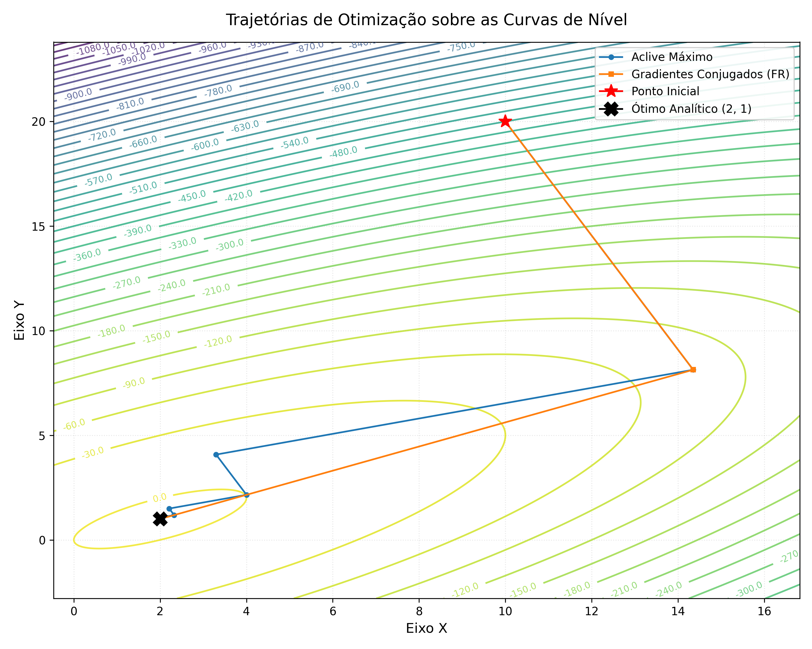

# Métodos de Otimização Multidimensional: Aclive Máximo e Gradientes Conjugados

## Resumo

Este projeto apresenta o estudo e a implementação computacional de métodos de otimização irrestrita multidimensional para maximizar funções de duas variáveis. Em particular, foca-se na comparação entre o método do **Aclive Máximo (Steepest Ascent)** e o método dos **Gradientes Conjugados (Fletcher-Reeves)**, utilizando busca unidimensional (line search) por interpolação quadrática de três pontos. O projeto está estruturado da seguinte forma:

``` plain text
└── 📁PPC4 - Otimização
    ├── .gitignore
    ├── Archive.zip
    ├── helper.pdf
    ├── helper.sage
    ├── main
    ├── orquestrador.cpp
    ├── output1.dat
    ├── output2.dat
    ├── plot.py
    ├── PPC4 e APC4.pdf
    ├── README.md
    ├── solver_otimizacao.hpp
    └── trajetorias_otimizacao.png
```

O motor do solver é o arquivo de cabeçalho [solver_otimizacao.hpp](solver_otimizacao.hpp), que contém as funções objetivo, os gradientes e as rotinas de otimização. O arquivo orquestrador [orquestrador.cpp](orquestrador.cpp) é responsável por receber as coordenadas iniciais inseridas pelo usuário e disparar os métodos numéricos, salvando as trajetórias em arquivos de saída (`output1.dat` para Aclive Máximo e `output2.dat` para Gradientes Conjugados). O script Python [plot.py](plot.py) lê os resultados simulados e gera a visualização gráfica das trajetórias sobre as curvas de nível da função objetivo, salva em [trajetorias_otimizacao.png](trajetorias_otimizacao.png). Por fim, o script [helper.sage](helper.sage) fornece o suporte simbólico em SageMath para validação analítica passo a passo.

---

## 1 Introdução

Na ciência da computação e engenharia, os problemas de otimização multidimensional irrestrita visam encontrar pontos de máximo ou mínimo de uma função escalar de múltiplas variáveis, $f(\mathbf{x}): \mathbb{R}^n \rightarrow \mathbb{R}$. A função objetivo analisada neste relatório é de natureza quadrática, dada por:

$$ f(x, y) = 2xy + 2x - x^2 - 2y^2 $$

Deseja-se encontrar o ponto de máximo $(\mathbf{x}^\ast) = (x^\ast, y^\ast)$ que maximiza $f(x, y)$. Analiticamente, as condições necessárias de otimalidade de primeira ordem exigem que o vetor gradiente seja nulo:

$$ \nabla f(x, y) = \begin{bmatrix} \frac{\partial f}{\partial x} \\ \frac{\partial f}{\partial y} \end{bmatrix} = \begin{bmatrix} 2y + 2 - 2x \\ 2x - 4y \end{bmatrix} = \begin{bmatrix} 0 \\ 0 \end{bmatrix} $$

Resolvendo o sistema linear resultante:

$$ \begin{cases} -2x + 2y = -2 \\ 2x - 4y = 0 \end{cases} $$

Somando as equações, obtém-se $-2y = -2 \Rightarrow y^\ast = 1.0$. Substituindo na segunda equação, resulta em $x^\ast = 2.0$. Portanto, o ponto ótimo analítico único é:

$$ (x^\ast, y^\ast) = (2.0, 1.0) $$

No qual a função assume o valor máximo $f(2.0, 1.0) = 2.0$.

Para solucionar numericamente este tipo de problema quando caminhos puramente analíticos tornam-se inviáveis em funções complexas, são empregados métodos iterativos que calculam direções de descida ou subida. Este relatório compara a eficiência e a velocidade de convergência de duas técnicas de gradiente aplicadas à maximização: o Método do Aclive Máximo e o Método dos Gradientes Conjugados.

---

## 2 Implementação dos Métodos Numéricos

Para garantir modularidade e alto desempenho, os métodos foram implementados em C++ diretamente no cabeçalho [solver_otimizacao.hpp](solver_otimizacao.hpp), sem a necessidade de resolvedores de otimização externos.

### 2.1 Método do Aclive Máximo (Steepest Ascent)
O método do Aclive Máximo atualiza a estimativa atual caminhando na direção do próprio vetor gradiente local $\nabla f(\mathbf{x}^{(k)})$, que aponta para a direção de maior crescimento instantâneo da função:

$$ \mathbf{p}^{(k)} = \nabla f(\mathbf{x}^{(k)}) $$

$$ \mathbf{x}^{(k+1)} = \mathbf{x}^{(k)} + h^\ast \mathbf{p}^{(k)} $$

Onde $h^\ast$ representa o passo de tamanho ótimo determinado através de uma rotina de busca unidimensional (Line Search).

Apesar de conceitualmente simples, o método do Aclive Máximo tende a sofrer de oscilações ortogonais (comportamento em "zigue-zague") em regiões de vales ou cumes estreitos, o que desacelera severamente a convergência perto do ponto ideal.

### 2.2 Método dos Gradientes Conjugados (Fletcher-Reeves)
O método de Gradientes Conjugados supera a lentidão do zigue-zague gerando direções de busca linearmente independentes e conjugadas em relação à matriz Hessiana do sistema. Para a primeira iteração ($k=0$), o método inicia com a própria direção do gradiente:

$$ \mathbf{p}^{(0)} = \nabla f(\mathbf{x}^{(0)}) $$

Para as iterações subsequentes ($k > 0$), a nova direção de busca incorpora uma fração da direção anterior, ponderada pelo parâmetro de Fletcher-Reeves ($\beta^{(k)}$):

$$ \mathbf{p}^{(k)} = \nabla f(\mathbf{x}^{(k)}) + \beta^{(k)} \mathbf{p}^{(k-1)} $$

$$ \beta^{(k)} = \frac{\|\nabla f(\mathbf{x}^{(k)})\|^2}{\|\nabla f(\mathbf{x}^{(k-1)})\|^2} $$

Este acoplamento ortogonal garante que cada nova direção não desfaça o progresso obtido pelas direções anteriores. Teoricamente, para funções quadráticas puras de $n$ variáveis, o método atinge convergência exata em no máximo $n$ passos (neste caso de duas dimensões, exatamente em 2 passos).

---

## 3 Busca Unidimensional por Interpolação Quadrática

A determinação do passo ótimo $h^\ast$ em cada etapa de busca é modelada como a maximização de uma função paramétrica unidimensional $g(h)$:

$$ g(h) = f(\mathbf{x}^{(k)} + h \mathbf{p}^{(k)}) $$

No código C++, essa otimização é realizada na função `line_search` utilizando o método de interpolação quadrática de três pontos. Escolhem-se três pontos iniciais equidistantemente distribuídos para avaliar a função: $h_0 = 0.0$, $h_1 = 0.1$ e $h_2 = 0.2$. Ajusta-se uma parábola local aos valores calculados $g(h_0)$, $g(h_1)$ e $g(h_2)$. A coordenada $h^\ast$ correspondente ao vértice dessa parábola é dada por:

$$ h^\ast = \frac{1}{2} \frac{(h_0^2 - h_2^2)g(h_1) + (h_2^2 - h_1^2)g(h_0) + (h_1^2 - h_0^2)g(h_2)}{(h_0 - h_2)g(h_1) + (h_2 - h_1)g(h_0) + (h_1 - h_0)g(h_2)} $$

Caso o denominador seja nulo (pontos colineares) ou a interpolação retorne um valor que não seja um máximo real, o algoritmo adota um mecanismo de salvaguarda (fallback), escolhendo o melhor dos três passos originais avaliados.

---

## 4 Resultados e Análise Comparativa

Para comparar ambos os métodos, as simulações foram executadas com partida no ponto inicial arbitrário:

$$ (x_0, y_0) = (10.0, 20.0) $$

A tolerância de convergência para a norma do gradiente foi definida em $10^{-6}$.

### Trajetórias de Otimização

Abaixo, a visualização gráfica gerada pelo script Python plota as trajetórias obtidas por cada método sobrepondo-se às curvas de nível da função objetivo:



### Discussão dos Arquivos de Dados

1.  **Aclive Máximo (`output1.dat`):**
    O método do Aclive Máximo exigiu **27 iterações** para convergir à vizinhança do ponto ótimo analítico $(2.0, 1.0)$. A oscilação em zigue-zague fica evidente a partir da alternância sistemática da direção dos passos ortogonais de busca, característicos deste método em superfícies elípticas de vales acentuados.
2.  **Gradientes Conjugados (`output2.dat`):**
    O método de Fletcher-Reeves demonstrou enorme superioridade computacional, convergindo de forma precisa para o ponto ótimo exato $(2.0, 1.0)$ em apenas **2 iterações**, atingindo uma norma de gradiente residual nula ($0.000000$). Este comportamento valida de forma experimental a propriedade teórica de convergência finita do método para funções quadráticas de dimensão $2$.

---

## 5 Instruções de Uso

Esta pasta contém o ecossistema automatizado para compilar e simular os métodos numéricos.

### Pré-requisitos

* **C++ Compiler**: Um compilador habilitado para C++11 ou superior (ex: `g++`, `clang++`).
* **Python 3.x**: Necessário instalar as dependências de visualização gráfica:

    ```bash
    pip install numpy pandas matplotlib
    ```

### Compilação e Execução (C++)

1. Abra o terminal neste diretório e compile o orquestrador:

    ```bash
    g++ -O3 orquestrador.cpp -o main
    ```

2. Execute o programa resultante:

    ```bash
    ./main
    ```

3. Insira as coordenadas iniciais desejadas no terminal (ex: `10.0` para $x_0$ e `20.0` para $y_0$). O programa executará os algoritmos e gerará os arquivos de dados `output1.dat` e `output2.dat`.

### Geração dos Gráficos (Python)

Uma vez que os arquivos `.dat` foram gerados, execute o script de plotagem para visualizar o gráfico das curvas de nível e caminhos de convergência:

```bash
python plot.py
```

Isso produzirá e salvará o arquivo de imagem `trajetorias_otimizacao.png` no diretório.
