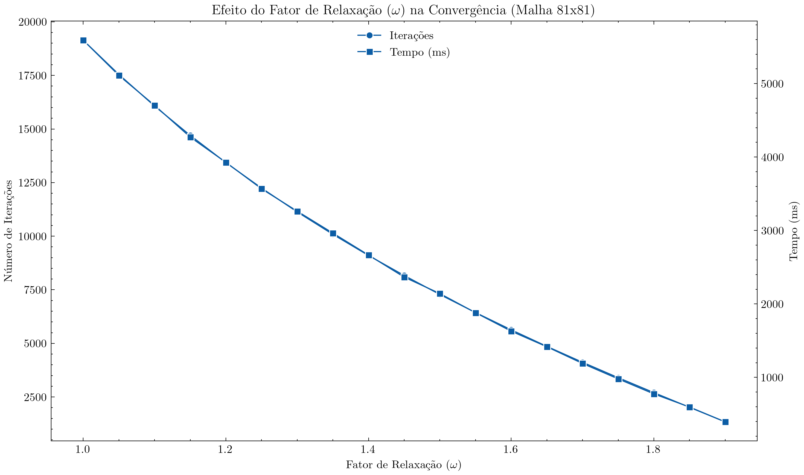
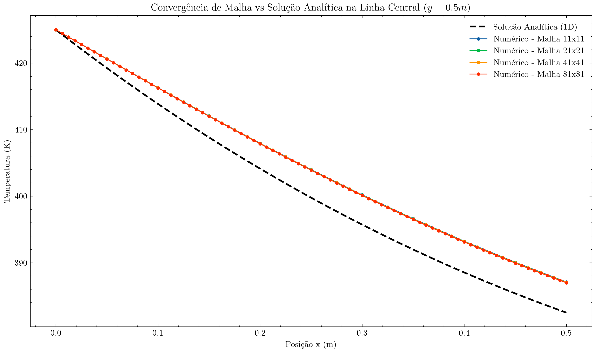
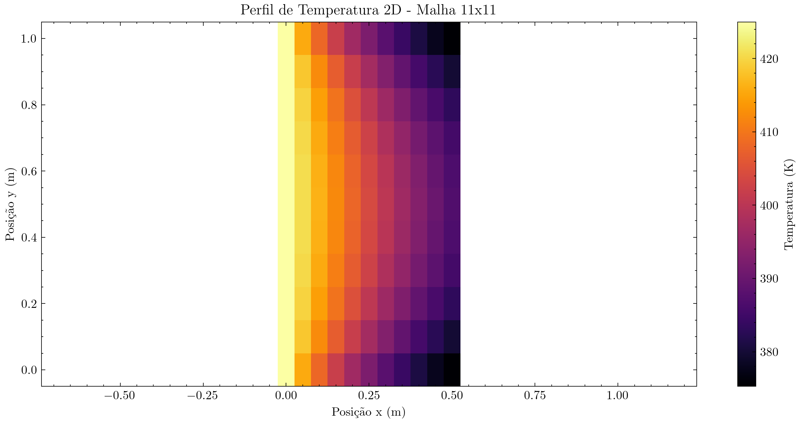
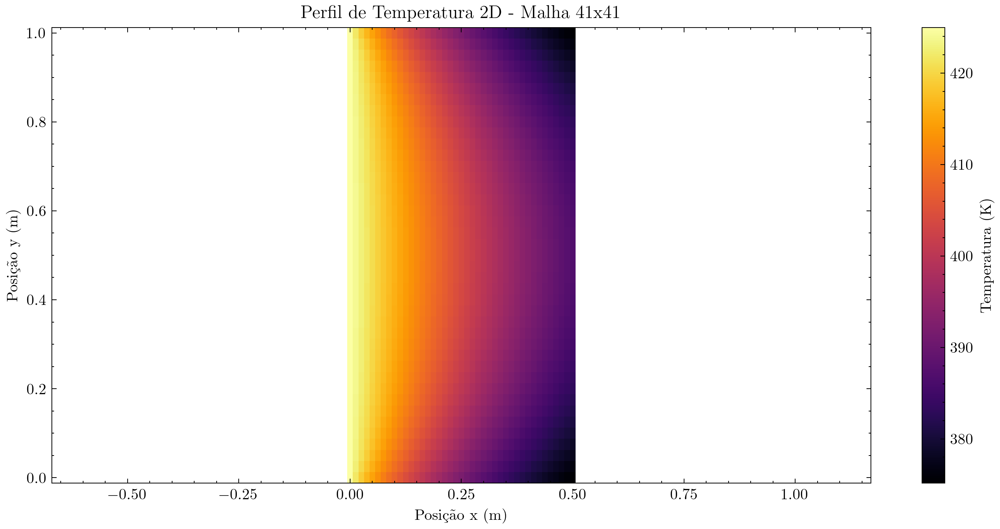

# PPC6/APC6 - Condução de Calor 2D em Aleta Retangular (MDF)

## Resumo

Este projeto implementa um solver numérico para o problema bidimensional de **condução de calor em regime permanente** em uma aleta retangular de seção transversal constante, submetida a temperatura prescrita na base e troca convectiva de calor nas demais superfícies. O problema é regido pela **equação de Laplace**

$$\frac{\partial^2 T}{\partial x^2} + \frac{\partial^2 T}{\partial y^2} = 0,$$

discretizada pelo **Método das Diferenças Finitas (MDF)** com condições de contorno mistas (Dirichlet na base, Robin/convectiva nas demais bordas). O sistema linear resultante é resolvido por dois caminhos distintos: **Eliminação de Gauss** (direto) e **Método de Liebmann/Gauss-Seidel** (iterativo, com e sem sobre-relaxação), permitindo comparar robustez, custo computacional e velocidade de convergência entre as abordagens. Os resultados numéricos ao longo da linha central da aleta são ainda comparados com a **solução analítica clássica unidimensional** para uma aleta de seção constante com extremidade convectiva. O projeto foi estruturado da seguinte maneira:

```plaintext
└── 📁PPC6/APC6 - Condução 2D em Aleta
    ├── .gitignore
    ├── main.cpp
    ├── classes.hpp
    ├── plotar_resultados.py
    ├── README.md
    ├── 📁resultados
    │   ├── resultados_gauss.csv
    │   ├── resultados_liebmann.csv
    │   ├── resultados_liebmann_relax.csv
    │   ├── estudo_relaxacao.csv
    │   ├── temperatura_11x11.csv
    │   ├── temperatura_21x21.csv
    │   ├── temperatura_41x41.csv
    │   └── temperatura_81x81.csv
    └── 📁figures
        ├── grafico_relaxacao.png
        ├── grafico_convergencia.png
        └── perfil_temperatura_{11x11,21x21,41x41,81x81}.png
```

Todo o motor numérico (configuração, malha, condições de contorno e solvers) está implementado em um arquivo header, [classes.hpp](classes.cpp), organizado em quatro classes independentes. Um arquivo orquestrador, [classes.hpp](classes.cpp), é responsável por fazer as análises propostas no roteiro. A plotagem de todos os gráficos é feita pelo script em Python [plotar_resultados.py](plotar_resultados.py), que lê os arquivos gerados em `resultados/` e salva as figuras em `figures/`.

Caso deseje somente as instruções de compilação e uso, favor se dirigir à seção [Instruções de Uso](#instruções-de-uso).

## 1 Introdução

Considere uma aleta retangular de seção transversal uniforme, de comprimento $L$ (direção $x$) e espessura $H$ (direção $y$), submetida às seguintes condições:

* **base** ($x=0$): temperatura prescrita $T_b$ (condição de Dirichlet);
* **demais superfícies** ($x=L$, $y=0$ e $y=H$): troca convectiva de calor com um fluido a temperatura $T_\infty$ e coeficiente convectivo $h$ (condição de Robin).

Admitindo regime permanente, propriedades constantes e ausência de geração interna de calor, o campo de temperaturas $T(x,y)$ no interior da aleta é regido pela equação de Laplace bidimensional. Como o domínio possui bordas com condições de tipos distintos (uma aresta com valor prescrito e três com fluxo dependente da própria solução), o problema exige a customização da equação de diferenças para cada tipo de nó de contorno — nós internos, nós de aresta convectiva e nós de canto — além do nó de canto compartilhado entre a base (Dirichlet) e as arestas adjacentes (Robin).

Para fins de validação, o perfil numérico ao longo da linha central ($y=H/2$) é comparado com a **solução analítica clássica** para uma aleta 1D de seção transversal constante e extremidade convectiva:

$$\theta(x) = \frac{T(x)-T_\infty}{T_b-T_\infty} = \frac{\cosh[m(L-x)] + \frac{h}{mk}\sinh[m(L-x)]}{\cosh(mL) + \frac{h}{mk}\sinh(mL)}, \qquad m = \sqrt{\frac{hP}{kA_c}}.$$

## 2 Formulação matemática

### 2.1 Nós internos

Aplicando a aproximação de diferenças centradas de segunda ordem às derivadas de $T$ em $x$ e $y$ e admitindo $\Delta x \neq \Delta y$, a equação de Laplace discretizada para um nó interno $(i,j)$ é

$$-2(1+\beta)\,T_{i,j} + T_{i+1,j} + T_{i-1,j} + \beta\left(T_{i,j+1}+T_{i,j-1}\right) = 0, \qquad \beta = \left(\frac{\Delta x}{\Delta y}\right)^2.$$

### 2.2 Nós de contorno convectivo (Robin)

A condição de Robin, $-k\left(\partial T/\partial \hat n\right)_w = h(T_w - T_\infty)$, é imposta por meio de um balanço de energia em um volume de controle centrado no nó de contorno (equivalente à técnica do nó fictício), eliminando o gradiente normal em favor dos nós internos vizinhos e do termo convectivo. Definindo

$$\theta = \frac{2\,\Delta x\,h}{k}, \qquad \omega = \frac{2\,\Delta y\,h}{k}, \qquad \beta = \left(\frac{\Delta x}{\Delta y}\right)^2,$$

as equações resultantes, para cada tipo de nó de aresta, são:

* **Aresta Sul/Norte** ($y=0$ ou $y=H$, exceto cantos):

$$-\left(\frac{2}{\sqrt\beta}+2\sqrt\beta+\theta\right)T_{i,j} + \frac{1}{\sqrt\beta}\left(T_{i-1,j}+T_{i+1,j}\right) + 2\sqrt\beta\,T_{viz} = -\theta\,T_\infty$$

* **Aresta Leste** ($x=L$, exceto cantos):

$$-\left(2\sqrt\beta+\frac{2}{\sqrt\beta}+\omega\right)T_{i,j} + \sqrt\beta\left(T_{i,j-1}+T_{i,j+1}\right) + \frac{2}{\sqrt\beta}\,T_{viz} = -\omega\,T_\infty$$

* **Nós de canto** (convectivos nas duas direções), com $\lambda = (\theta+\omega)/2$:

$$-\left(\sqrt\beta+\frac{1}{\sqrt\beta}+\lambda\right)T_{i,j} + \frac{1}{\sqrt\beta}\,T_{viz,x} + \sqrt\beta\,T_{viz,y} = -\lambda\,T_\infty$$

em que $T_{viz}$ denota, em cada caso, o(s) nó(s) interno(s) vizinho(s) válido(s) (a expressão exata depende de qual quadrante do domínio o nó de canto ocupa).

### 2.3 Sistema linear e métodos de solução

Reunindo as equações de todos os $N_x \times N_y$ nós obtém-se o sistema $[A]\{T\}=\{b\}$, esparso (no máximo 5 termos não nulos por linha), que pode ser resolvido por:

1. **Eliminação de Gauss** com pivoteamento parcial — método direto, custo $\mathcal{O}(n^3)$, robusto porém caro em memória e tempo para malhas finas;
2. **Método de Liebmann (Gauss-Seidel)** — iterativo, aproveita a esparsidade da matriz:

$$T_{i,j}^{novo} = \frac{b_{i,j} - \sum_{k} A_{i,k}\,T_k^{atual}}{A_{i,i}}$$

1. **Liebmann com sobre-relaxação (SOR)**:

$$T_{i,j}^{novo} = \omega_{relax}\,T_{i,j}^{novo} + (1-\omega_{relax})\,T_{i,j}^{antigo}, \qquad 0 < \omega_{relax} < 2.$$

O **critério de convergência** adotado é o erro máximo absoluto entre iterações consecutivas em todo o domínio:

$$\varepsilon = \max_{i,j}\left|T_{i,j}^{novo} - T_{i,j}^{antigo}\right| < tol.$$

## 3 Implementação

O código é organizado em quatro classes com responsabilidades bem definidas:

* **`ConfigSimulacao`**: encapsula os parâmetros físicos e numéricos ($L$, $H$, $N_x$, $N_y$, $k$, $h$, $T_b$, $T_\infty$, tolerância, máximo de iterações) e calcula as constantes geométricas derivadas ($\Delta x$, $\Delta y$, $\beta$). Também é capaz de capturar esses valores interativamente pelo terminal (método `configurarTerminal()`), embora o `main()` distribuído use os valores padrão diretamente, sem invocar esse prompt.
* **`Mesh`**: constrói a malha estruturada de nós (classe `Node`) e expõe métodos (`north()`, `south()`, `east()`, `west()`) que retornam os IDs dos nós em cada fronteira, para atribuição das condições de contorno.
* **`System`**: guarda o campo de temperaturas e o tipo/valor da condição de contorno de cada nó, através de uma interface fluente (`set_bc(ids).dirichlet(Tb)` / `.robin(Tinf, h)`).
* **`Solver`**: monta a equação de cada nó (`monta_equacao`) conforme as expressões da Seção 2 e resolve o sistema tanto por `eliminacao_gaussiana()` quanto por `liebmann(omega_relax)`.

**Observação sobre a aplicação de condições de contorno:** A última condição de contorno aplicada é a que prevalece, o código emite um aviso caso uma condição seja sobrescrita (não há prejuízo numérico, mas altera a interpretação física). Recomenda-se aplicar primeiro Robin e depois Dirichlet.

### 3.1 Configuração dos parâmetros pelo terminal

A classe `ConfigSimulacao` possui valores padrão para todos os parâmetros ($N_x=11$, $N_y=11$, $L=0{,}5$, $H=1{,}0$, $k=200$, $h=100$, $T_b=425$, $T_\infty=273$, $tol=10^{-4}$, $maxIt=200000$), mas o método `configurarTerminal()` permite sobrescrevê-los interativamente. Ao ser chamado, ele prompta cada variável no terminal, apresentando o valor padrão entre colchetes. Se o usuário pressionar Enter sem digitar nada, o valor padrão é mantido; caso contrário, o valor digitado é utilizado e as constantes geométricas ($\Delta x$, $\Delta y$, $\beta$) são recalculadas automaticamente. Exemplo de uso:

```cpp
ConfigSimulacao config;       // cria com valores padrão
config.configurarTerminal();  // prompta o usuário para alterar cada parâmetro
```

Alternativamente, os parâmetros podem ser definidos diretamente no construtor, como é feito nas análises de refinamento de malha:

```cpp
ConfigSimulacao config(81, 81);  // malha 81×81, demais parâmetros mantêm o default
```

### 3.2 Aplicação de condições de contorno (interface fluente)

A classe `System` utiliza um padrão de *proxy* para permitir a aplicação de condições de contorno de forma encadeada e legível. O método `set_bc()` aceita tanto um único ID de nó quanto um vetor de IDs (retornado pelos métodos da `Mesh`) e retorna um objeto `BoundaryProxy`, sobre o qual se chama `.dirichlet()` ou `.robin()`. Cada um desses métodos possui sobrecargas para valor escalar (uniforme em todos os nós) e para vetores (um valor por nó), permitindo condições não-uniformes:

```cpp
// Condição de Dirichlet uniforme na base (aresta oeste)
sistema.set_bc(malha.west()).dirichlet(config.get_T_b());

// Condição de Robin uniforme nas demais arestas
sistema.set_bc(malha.north()).robin(config.get_T_inf(), config.get_h());
sistema.set_bc(malha.south()).robin(config.get_T_inf(), config.get_h());
sistema.set_bc(malha.east()).robin(config.get_T_inf(), config.get_h());

// Condição de Robin não-uniforme (um h por nó)
std::vector<double> h_por_no = { /* ... */ };
std::vector<double> Tinf_por_no = { /* ... */ };
sistema.set_bc(malha.east()).robin(Tinf_por_no, h_por_no);
```

A ordem de aplicação é relevante nos **nós de canto**, onde duas arestas se encontram e potencialmente definem condições distintas. Nesses casos, a última condição aplicada prevalece (o código emite um `[AVISO]` no terminal quando detecta sobrescrita). A recomendação é aplicar primeiro as condições Robin e por último a Dirichlet, garantindo que nós compartilhados com a base mantenham a temperatura prescrita.

### 3.3 Montagem do sistema de equações

A função `Solver::monta_equacao(int i)` inspeciona o tipo de condição de contorno do nó `i` e sua posição na malha (interior, aresta ou canto) para montar a linha correspondente do sistema $[A]\{T\}=\{b\}$. A lógica classifica cada nó em um dos seguintes cenários:

1. **Nó Dirichlet**: equação trivial $T_i = T_b$ (diagonal $=1$, sem vizinhos);
2. **Nó Robin de aresta**: identifica se o nó está numa borda horizontal (norte/sul) ou vertical (leste) e aplica a discretização correspondente da Seção 2.2;
3. **Nó Robin de canto**: detecta automaticamente se o nó está num dos quatro cantos do domínio e aplica a equação de canto com coeficientes $\theta$, $\omega$ e $\lambda$ adequados;
4. **Nó interno**: aplica a equação de Laplace discretizada padrão da Seção 2.1.

As equações são armazenadas numa struct `Equacao` compacta (diagonal, lista de pares vizinho/coeficiente e termo independente), que é então utilizada tanto pelo método direto quanto pelo iterativo.

## 4 Resultados

*(resultados obtidos executando o programa compilado com `g++ -O3 -std=c++17`, sem alteração dos parâmetros padrão: $L=0{,}5$ m, $H=1{,}0$ m, $k=200$ W/(m·K), $h=100$ W/(m²·K), $T_b=425$ K, $T_\infty=273$ K, $tol=10^{-4}$)*

### 4.1 Comparação entre os métodos de solução (malha 21×21, 441 nós)

| Método | Iterações | Erro final | Tempo de execução |
| --- | --- | --- | --- |
| Eliminação de Gauss | — (direto) | — | 110,769 ms |
| Liebmann sem relaxamento ($\omega=1{,}0$) | 1636 | $9{,}949\times10^{-5}$ | 28,317 ms |
| Liebmann com relaxamento ($\omega=1{,}5$) | 594 | $9{,}815\times10^{-5}$ | 10,409 ms |

Os três métodos convergem para o mesmo campo de temperaturas: a maior diferença nó a nó entre a solução via Gauss e a via Liebmann relaxado é de apenas $5{,}1\times10^{-3}$ K, o que valida cruzadamente as duas implementações. Note-se que, apesar de o método direto ser competitivo nesta malha pequena, seu custo $\mathcal{O}(n^3)$ o torna proibitivo para malhas finas (na malha 81×81, com $n=6561$ incógnitas, o mesmo procedimento demandaria armazenar e triangularizar uma matriz densa $6561\times6561$), o que justifica o uso de Liebmann nos estudos de refinamento da Seção 4.3.

### 4.2 Efeito do fator de relaxação $\omega$ (malha 81×81, 6561 nós)

| $\omega$ | Iterações | Tempo (ms) | | $\omega$ | Iterações | Tempo (ms) |
| --- | --- | --- | --- | --- | --- | --- |
| 1,00 | 19142 | 4561,9 | | 1,50 | 7280 | 1777,9 |
| 1,10 | 16070 | 3907,5 | | 1,60 | 5631 | 1371,7 |
| 1,20 | 13432 | 3207,1 | | 1,70 | 4117 | 985,6 |
| 1,30 | 11132 | 2663,6 | | 1,80 | 2702 | 646,1 |
| 1,40 | 9099 | 2158,6 | | 1,90 | 1337 | 318,4 |

*(tabela completa em `resultados/estudo_relaxacao.csv`)*



Dentro da faixa testada ($1{,}0 \le \omega < 1{,}95$), o número de iterações **decresce monotonicamente** conforme $\omega \to 2$, chegando a uma redução de mais de 14$\times$ (19142 $\rightarrow$ 1337 iterações) e de igual ordem no tempo de execução (4562 ms $\rightarrow$ 318 ms) apenas ajustando o fator de relaxação. Não foi observado um mínimo dentro do intervalo estudado — o que sugere que o $\omega_{ótimo}$ para esta malha está próximo do limite teórico de estabilidade $\omega \to 2$.

### 4.3 Refinamento de malha vs. solução analítica 1D

Comparando o perfil numérico na linha central ($y=0{,}5$ m) com a solução analítica clássica (Seção 2, com $m=\sqrt{2h/(kH)} = 1{,}000\ \text{m}^{-1}$ para os parâmetros padrão):

| Malha | Erro % médio | Erro % máximo | Erro absoluto máximo (K) |
| --- | --- | --- | --- |
| 11×11 | 0,877 % | 1,215 % | 4,696 K |
| 21×21 | 0,888 % | 1,207 % | 4,669 K |
| 41×41 | 0,892 % | 1,202 % | 4,649 K |
| 81×81 | 0,885 % | 1,185 % | 4,585 K |



O ponto central desta análise: **o erro percentual entre numérico e analítico praticamente não se altera com o refinamento de malha** (permanece em torno de 0,88% médio / 1,2% máximo do 11×11 ao 81×81). Isso é a evidência de que essa diferença **não é erro de discretização** — um erro de truncamento do MDF diminuiria com $\Delta x^2,\Delta y^2$ ao refinar a malha, o que claramente não ocorre aqui. A diferença residual é, portanto, de natureza **física/de modelagem**: a solução analítica 1D pressupõe temperatura uniforme em cada seção transversal (aproximação de aleta "concentrada"), hipótese que só é adequada quando o número de Biot

$$Bi = \frac{h(H/2)}{k} = \frac{100 \times 0{,}5}{200} = 0{,}25$$

é muito menor que 1 (o limite inferior comumente citado é de $Bi \lt 0.1$ ). Com $Bi=0{,}25$, já existe gradiente de temperatura não desprezível na direção $y$ — efeito que o modelo 2D captura corretamente e a teoria 1D ignora por construção.

Para confirmar essa hipótese, repetiu-se a simulação variando $h$ e $k$ de forma a reduzir o $Bi$, mantendo os demais parâmetros fixos:

| $k$ | $h$ | $Bi=h(H/2)/k$ | Diferença máx. numérico–analítico (K) |
| --- | --- | --- | --- |
| 200 | 100 (caso base) | 0,250 | 4,64 |
| 200 | 50 | 0,125 | 2,55 |
| 200 | 20 | 0,050 | 1,08 |
| 1000 | 100 | 0,050 | 1,08 |
| 2000 | 100 | 0,025 | 0,55 |
| 200 | 1 | 0,0025 | 0,06 |

A diferença cai de forma aproximadamente proporcional ao $Bi$ (e depende apenas da razão $h/k$, não de $h$ e $k$ isoladamente — note que $h=20,k=200$ e $h=100,k=1000$, com o mesmo $Bi=0{,}05$, produzem exatamente a mesma diferença), confirmando que o gap observado é majoritariamente explicado pela violação da hipótese de aleta concentrada, e não por um problema de implementação.

### 4.4 Mapas de temperatura 2D e influência das condições convectivas

Os mapas de contorno tornam visível a influência das condições convectivas sobre o campo bidimensional: a isoterma mais quente acompanha fielmente a base ($x=0$, $T=T_b$, condição de Dirichlet, perfil praticamente vertical e uniforme em $y$), enquanto próximo às arestas convectivas (norte, sul e leste) as isotermas se curvam visivelmente em direção a $T_\infty$, refletindo a perda de calor lateral. Esse encurvamento é justamente a componente 2D que a teoria 1D da Seção 2 não reproduz, e sua intensidade cresce com o número de Biot — quanto maior $h$ em relação a $k$, mais acentuado o gradiente transversal (em $y$) próximo às bordas convectivas.

| Malha 11×11 | Malha 21×21 |
| --- | --- |
|  |  |

| Malha 41×41 | Malha 81×81 |
| --- | --- |
|  |  |

### 4.5 Principais fontes de diferença entre modelo numérico e solução de referência

Em suma, as diferenças residuais observadas nesta atividade estão associadas a:

(i) erro de truncamento do MDF, de ordem $\mathcal{O}(\Delta x^2, \Delta y^2)$ — presente, mas mostrado na Seção 4.3 como não dominante, já que o erro numérico-analítico não diminui com o refinamento;
(ii) à **simplificação intrínseca da teoria 1D clássica** usada como referência, válida apenas para $Bi \ll 1$ — este é o fator dominante no caso padrão ($Bi=0{,}25$), como demonstrado na Seção 4.3;

## Instruções de Uso

### Pré-requisitos

* **Compilador C++**: GCC (`g++`) ou Clang com suporte a C++17;
* **Biblioteca Eigen3** (usada apenas como contêiner de matriz densa para a Eliminação de Gauss; toda a lógica de montagem e resolução do sistema é própria).

  * Debian/Ubuntu:
  
    ```bash
    sudo apt-get install libeigen3-dev
    ```

  * Fedora/RHEL:
  
    ```bash
    sudo dnf install eigen3-devel
    ```

  * Arch Linux:
  
    ```bash
    sudo pacman -S eigen
    ```

* **Python 3.x**, com as bibliotecas `polars`, `seaborn`, `matplotlib`, `scienceplots` e `numpy`:

```bash
pip install polars seaborn matplotlib scienceplots numpy
```

### Passo 1: Compilação do Orquestrador (C++)

```bash
g++ -O3 main.cpp -o main
```

> **Nota:** O código inclui os headers Eigen com o caminho `<eigen3/Eigen/Core>`, que funciona diretamente na maioria das distribuições Linux onde o pacote `libeigen3-dev` está instalado no caminho padrão. Caso o compilador não encontre os headers, adicione a flag `-I` apontando para o diretório de instalação (e.g. `-I/usr/include/eigen3` ou `-I/usr/local/include`).

### Passo 2: Execução

```bash
./main
```

Diferentemente de uma versão interativa, o `main()` distribuído **não solicita parâmetros pelo terminal** (o método `configurarTerminal()` existe na classe `ConfigSimulacao` e pode ser chamado, isso prompta o usuário à inserir valores) — o programa executa diretamente, na sequência, com os parâmetros padrão ($L=0{,}5$ m, $H=1{,}0$ m, $k=200$ W/(m·K), $h=100$ W/(m²·K), $T_b=425$ K, $T_\infty=273$ K, $tol=10^{-4}$):

1. resolução da malha base 21×21 pelos três métodos (Gauss, Liebmann sem relaxação, Liebmann com relaxação $\omega=1{,}5$);
2. estudo do fator de relaxação $\omega \in [1{,}0,\,1{,}9]$ na malha 81×81;
3. estudo de refinamento de malha (11×11, 21×21, 41×41, 81×81) com $\omega=1{,}5$.

O programa salva um arquivo `.csv` por caso (`id,x,y,T`) e imprime no terminal, para cada execução: o número de iterações, o erro final, o tempo de execução e eventuais avisos de conflito de condição de contorno em nós de canto.

### Passo 3: Geração dos Gráficos

Com `resultados/` já populado, execute:

```bash
python plotar_resultados.py
```

O script cria o diretório `figures/` (caso não exista) e gera três famílias de gráficos:

* `grafico_relaxacao.png`: iterações e tempo vs. $\omega$;
* `grafico_convergencia.png`: perfil numérico (linha central) para cada malha vs. solução analítica 1D;
* `perfil_temperatura_{N}x{N}.png`: mapa de contorno 2D da temperatura, um por malha do estudo de refinamento.

### Passo 4: Verificação de Saídas

Os resultados poderão ser conferidos nos seguintes arquivos:

1. `resultados/resultados_gauss.csv`, `resultados_liebmann.csv`, `resultados_liebmann_relax.csv`: campo de temperatura completo ($x,y,T$) da malha 21×21 para cada método;
2. `resultados/estudo_relaxacao.csv`: iterações e tempo de execução para cada $\omega$ testado;
3. `resultados/temperatura_{N}x{N}.csv`: campo de temperatura completo para cada malha do estudo de refinamento;
4. `figures/*.png`: gráficos descritos no Passo 3.
